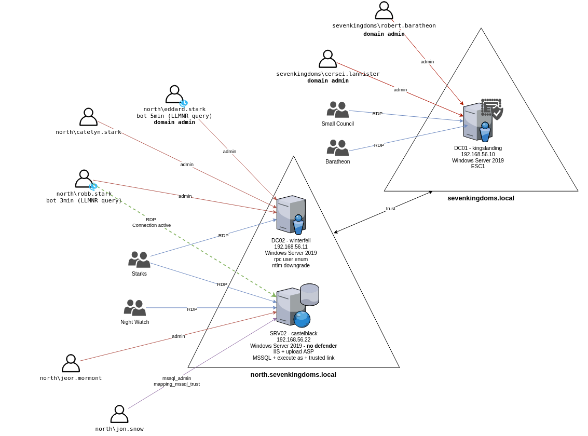

# GOAD-Light

This is a light version of goad without the essos domain. This lab was build for computer with less performance.
Missing scenarios:
- cross forest exploitation (no more external forest)
- mssql trusted link
- some old computer vulnerabilities (zero logon, petitpotam unauthent,...)
- ESC4, ESC2/3

### Servers
This lab is actually composed of five virtual machines:
- **dynamo-dc01** : DC01  running on Windows Server 2019 (with windefender enabled by default)
- **finance-dc02**   : DC02  running on Windows Server 2019 (with windefender enabled by default)
- **warehouse-srv02**  : SRV02 running on Windows Server 2019 (with windefender **disabled** by default)

#### domain : north.dynamo.local
- **finance-dc02**     : DC01
- **warehouse-srv02**    : SRV02 : MSSQL / IIS

#### domain : dynamo.local
- **dynamo-dc01**   : DC02

The lab setup is automated using vagrant and ansible automation tools.
You can change the vm version in the Vagrantfile according to Stefan Scherer vagrant repository : https://app.vagrantup.com/StefanScherer

### Users/Groups and associated vulnerabilites/scenarios

- You can find a lot of the available scenarios on [https://mayfly277.github.io/categories/ad/](https://mayfly277.github.io/categories/ad/)

NORTH.DYNAMO.LOCAL
- STARKS:              RDP on WINTERFELL AND CASTELBLACK
  - maria.garcia:        Execute as user on mssql
  - jose.garcia:      DOMAIN ADMIN NORTH/ (bot 5min) LLMRN request to do NTLM relay with responder
  - laura.garcia:     
  - jesus.garcia:        bot (3min) RESPONDER LLMR
  - susana.garcia:       
  - vicente.garcia:     ASREP_ROASTING
  - raul.garcia:      
  - theon.greyjoy:
  - juan.iniesta:          mssql admin / KERBEROASTING / group cross domain / mssql trusted link
  - pepe:             PASSWORD SPRAY (user=password)
- NIGHT WATCH:         RDP on CASTELBLACK
  - samuel.tejero:     Password in ldap description / mssql execute as login
                       GPO abuse (Edit Settings on "STARKWALLPAPER" GPO)
  - juan.iniesta:          (see starks)
  - ivan.martinez:      (see mormont)
- MORMONT:             RDP on CASTELBLACK
  - ivan.martinez:      ACL writedacl-writeowner on group ITSupport
- AcrossTheSea :       cross forest group

DYNAMO.LOCAL
- LANISTERS
  - kiko.lopez:   ACL forcechangepassword on jaime.lanister
  - jaime.lopez:   ACL genericwrite-on-user javier.lopez
  - daniel.lopez:   ACL self-self-membership-on-group WarehouseOps
  - carla.lopez:  DOMAIN ADMIN DYNAMO
- BARATHEON:           RDP on KINGSLANDING
  - roberto.perez:  DOMAIN ADMIN DYNAMO
  - javier.lopez: ACL Write DACL on daniel.lopez
  - manuel.baratheon:
  - sandra.perez: ACL genericall-on-computer dynamo-dc01 / ACL writeproperty-self-membership Domain Admins
- SMALL COUNCIL :      ACL add Member to group dragon stone / RDP on KINGSLANDING
  - particio.burguense:    ACL writeproperty-on-group Domain Admins
  - lord.vega:        ACL genericall-on-group Domain Admins / Acrossthenarrossea
  - maestro.paellero:   ACL write owner on group Domain Admins
- DRAGONSTONE :        ACL Write Owner on KINGSGUARD
- KINGSGUARD :         ACL generic all on user sandra.perez
- AccorsTheNarrowSea:       cross forest group

### Computers Users and group permissions

- DYNAMO
  - DC01 : dynamo-dc01.dynamo.local (Windows Server 2019) (DYNAMO DC)
    - Admins : roberto.perez (U), carla.lopez (U)
    - RDP: WarehouseOps (G)

- NORTH
  - DC02 : finance-dc02.north.dynamo.local (Windows Server 2019) (NORTH DC)
    - Admins : jose.garcia (U), laura.garcia (U), jesus.garcia (U)
    - RDP: Garcia(G)

  - SRV02 : warehouse-srv02.essos.local (Windows Server 2019) (IIS, MSSQL, SMB share)
    - Admins: ivan.martinez (U)
    - RDP: ITSupport (G), Martinez (G), Garcia (G)
    - IIS : allow asp upload, run as NT Authority/network
    - MSSQL:
      - admin : juan.iniesta
      - impersonate : 
        - execute as login : samwel.tarlly -> sa
        - execute as user : maria.garcia -> dbo
